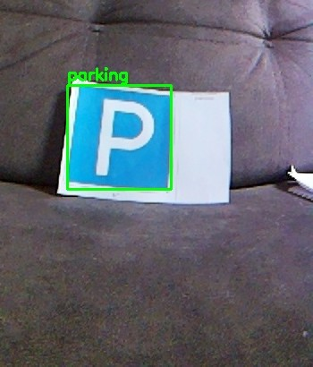

# Fira NDTP

  
  

Команда, которая строит автономного робота **kiborg** сразу для двух
соревнований по автономному вождению.

---

*Первое живое распознавание настоящего распечатанного знака камерой kiborg — знак «Место стоянки» (Б.7).*

## Что мы делаем

**kiborg** — двухколёсный дифференциальный робот на Raspberry Pi 4B,
который должен научиться:

1. Ехать по трассе, следуя разметке, для **FIRA Autonomous Cars League
   (Physical Division)** — 1:10 RC-машина, трасса без вмешательства
   человека.
2. Развозить «пассажиров» по городскому полигону для хакатона
   **«Движение по городу» (Кубок РТК Высшая лига)** — следование по
   прерывистой линии, реакция на знаки ГОСТ Р 52289–2019, остановка
   у «Место остановки», финиш у «Место стоянки».

Один робот, одна кодовая база — [`fira-autonomous-rc-car`](https://github.com/Fira-NDTP/fira-autonomous-rc-car),
две задачи.

## Как устроено техническое решение

- **Восприятие**: классический CV (HSV-пороги + анализ формы контуров)
  для детекции знаков — уже работает и проверено на настоящих
  распечатанных знаках вживую. Параллельно готовится нейросетевой
  детектор (YOLO26) на реальном датасете — RTSD + собственные съёмки.
- **Следование по линии**: перспективное преобразование в bird's-eye
  вид + гистограммный поиск полосы.
- **Управление**: дифференциальный привод, Arduino + серийный протокол,
  веб-телеуправление с MJPEG-стримом для отладки без монитора на роботе.
- **Калибровка без дисплея** — робот без физического экрана, вся
  настройка (порогов цвета, геометрии камеры) идёт через веб-интерфейс
  в браузере с любого устройства в сети.

Всё разрабатывается через "искать готовое → проверять → адаптировать",
не с нуля — честная атрибуция источников в
[`EXTERNAL_SOURCES.md`](https://github.com/Fira-NDTP/fira-autonomous-rc-car/blob/master/EXTERNAL_SOURCES.md)
репозитория.

## Статус

В активной разработке. Автономный пайплайн запускается и не падает на
реальном железе, первый настоящий знак распознан корректно, моторы пока
не тестировались в закрытом цикле «камера → решение → движение».
Подробный честный статус — в `autonomy/README.md` репозитория.

## Команда

- [Anton Petnitsky](https://github.com/Mukller) — разработка, железо, интеграция
- [itsMatrik](https://github.com/itsMatrik) — датасет и обучение модели детекции знаков
- [notKitory](https://github.com/notKitory)

---

Репозиторий приватный — доступ только у участников команды.

