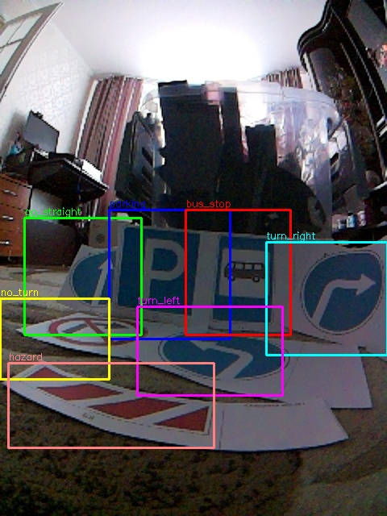

# Fira NDTP

  
  

Команда, которая строит автономного робота **kiborg** сразу для двух
соревнований по автономному вождению.

**Все 8 знаков полигона в одном кадре с камеры робота** — собственная
YOLO-модель детекции знаков (close-up ретрейн) размечает их вживую.

---

## Что мы делаем

**kiborg** — двухколёсный дифференциальный робот на Raspberry Pi 4B,
который должен научиться:

1. Ехать по трассе, следуя разметке, для **FIRA Autonomous Cars League
   (Physical Division)** — 1:10 RC-машина, трасса без вмешательства
   человека.
2. Развозить «пассажиров» по городскому полигону для хакатона
   **«Движение по городу» (Кубок РТК Высшая лига)** — следование по
   прерывистой линии, реакция на знаки ГОСТ Р 52289–2019, остановка
   у «Место остановки», финиш у «Место стоянки».

Один робот, одна кодовая база — [`fira-autonomous-rc-car`](https://github.com/Fira-NDTP/fira-autonomous-rc-car),
две задачи.

## Как устроено техническое решение

- **Зрение**: два бэкенда за одним интерфейсом. Классический CV
  (HSV-пороги + форма контуров) — рабочий дефолт; параллельно своя
  YOLO26-модель детекции знаков, дообученная на близких ракурсах
  камеры робота: на собственной съёмке полигонных знаков уверенно
  видит весь набор (см. фото выше), веса лежат прямо в репозитории.
- **Следование по линии**: bird's-eye warp + гистограмма/центроид,
  sliding-window трекер пунктирной линии с оценкой кривизны, память
  последнего смещения при потере линии, адаптивная скорость.
- **Управление и безопасность**: Arduino + serial-протокол с watchdog'ами
  на обоих концах линии (Pi-процесс И сама прошивка — при тишине
  по UART моторы глушатся за 400 мс), веб-телеуправление с MJPEG-стримом
  для отладки без монитора на роботе.
- **Калибровка без дисплея** — вся настройка (пороги цвета, геометрия
  камеры) через веб-интерфейс в браузере с любого устройства в сети.

Всё разрабатывается через «искать готовое → проверять → адаптировать»,
не с нуля — честная атрибуция источников в
[`EXTERNAL_SOURCES.md`](https://github.com/Fira-NDTP/fira-autonomous-rc-car/blob/master/EXTERNAL_SOURCES.md)
репозитория.

## Статус

В активной разработке. Автономный пайплайн живёт на реальном железе,
стейт-машина знаковых сценариев отрабатывает циклы на живой камере,
прошивка привода протестирована на колесах. Ближайшее: калибровка
камеры на трассе, первый закрытый заезд «камера → решение → движение».
Честный подробный статус — в `autonomy/README.md` репозитория.

## Команда

- [Anton Petnitsky](https://github.com/Mukller) — разработка, железо, интеграция
- [itsMatrik](https://github.com/itsMatrik) — датасет и обучение модели детекции знаков
- [notKitory](https://github.com/notKitory)

---

Репозиторий приватный — доступ только у участников команды.

